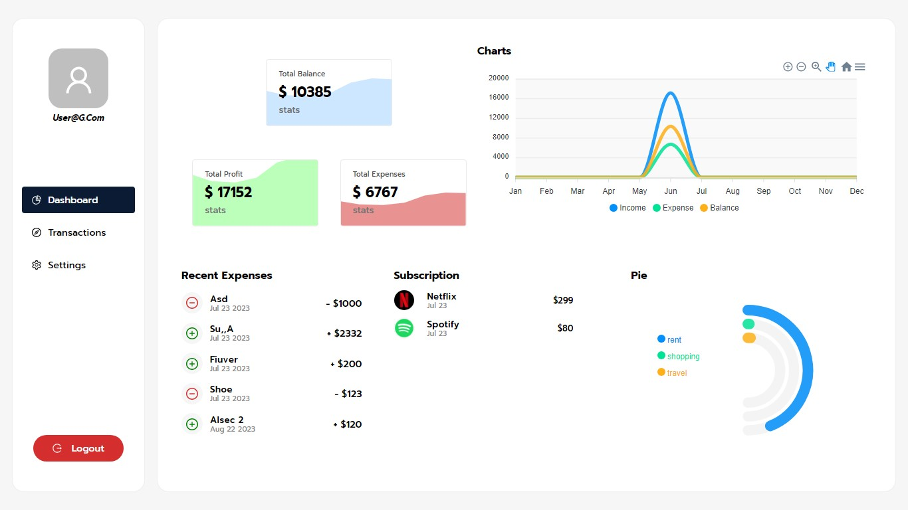

# CoinStrike🪙 -- Personal Finance Tracker📈

The CoinStrike is a comprehensive personal finance tracker web application built using React and Node.js. It offers users a powerful platform to manage their financial activities, track expenses, monitor income, and gain insights into their spending habits.

With CoinStrike, users can create and manage their financial transactions, including expenses, income, and subscriptions. They can categorize transactions based on predefined categories such as groceries, transportation, dining, entertainment, and more. The application provides visualizations and charts to help users analyze their budget.

# use this credentials for demo:
    - email: dummy@g.com
    - password: 12121212
For Full Experiance {DEMO}
# 🪙 Development Details

The project has been developed as a part of [Fastest Coder Hackathon](https://www.fastestcoderfirst.com/) project with extensive [usage of Github CoPilot](#github-copilot-usage). 


## CoinStrike Development Journey with Copilot Usage

Throughout the development of CoinStrike, we embarked on a unique and innovative path, making use of the powerful capabilities of GitHub Copilot. This cutting-edge AI-powered code generation tool revolutionized our development experience and opened up new possibilities. Here's an overview of how we harnessed Copilot's potential and the remarkable advantages it brought to our project:

1. **Intelligent Code Generation**: Copilot acted as our intelligent coding companion, assisting us in generating intricate code structures, implementing complex algorithms, and producing boilerplate code. By comprehending the context of our project, it offered precise and contextually relevant code snippets, significantly reducing our development time and effort.

2. **Adaptation of our Coding Style**: Copilot adhered to established coding conventions and best practices, promoting a consistent coding style throughout our project. By aligning with industry-standard formatting, naming conventions, and indentation rules, Copilot ensured that our code was cohesive and easy to follow for developers working on the project.

3. **Precise Code Suggestions**: Copilot's code suggestions were accurate and contextually relevant, making our code more readable and understandable. It provided us with intuitive variable names, clear function and method signatures, and concise yet descriptive comments, ensuring that the purpose and functionality of our code were easily comprehensible.

4. **Make Code Readable**:Copilot proved invaluable in code refactoring efforts, suggesting improvements to our existing codebase. It helped identify redundant code, eliminate unnecessary complexity, and propose more concise and efficient implementations. These automated refactoring suggestions greatly contributed to code readability by making it more streamlined and focused.

5. **Errorless Code **: Copilot's advanced machine learning algorithms analyzed our code context and provided accurate suggestions to prevent common errors. It helped us catch syntax mistakes, undefined variables, and other common coding pitfalls before they caused issues.Copilot generated code snippets that handled error scenarios efficiently. It offered suggestions for try-catch blocks, error handling mechanisms, and error logging, ensuring robust error handling in our applications.

CoinStrike's development voyage was uniquely shaped by our partnership with GitHub Copilot. The amalgamation of human creativity and AI-powered code generation propelled us towards building an exceptional personal finance tracker that exceeds expectations.

# 🪙 Work Proof

More detailed information like [Screenshots](./screenshots.md), a [Demo Video](./media/hackathon_video.webm)  about the application extensive [Features](./userguide.md#features), and intutive usage can be found in the [User Guide](./userguide.md) and [Screenshots](./screenshots.md) file.

## 🪙 Architecure and Technical Details

The project is developed using the following MERN technologies and frameworks:

- Frontend: ReactJs, Redux, JavaScript, HTML, CSS
- Backend: Node.js with Express
- Database: mongoDB

## 🪙 Team
The project is developed from scratch by the team members and no code was copied from any other source. 

| Name | Github Handle | Image |
| --- | --- | --- |
| Lokesh Kumar M | @LokeshKumar-Dev  |  |

## 🪙 Mongo Database Models

The application consists of the following entities:

1. Transaction:
    - ID: String or Number
    - Description: String
    - Amount: Number
    - Type: String (income or expense or subscription)
    - Category: String
    - Cycle: String (monthly, quarterly, or annual)
    - Status: Boolean
    - Auto: Boolean
    - Date: Date

2. User:
    - First Name: String
    - Last Name: String
    - Date of Birth: Date
    - Salary: Number
    - Email: String (required, unique)
    - Image: String
    - Password: String (required)
    - Currency: String (default: "INR")
    - Expense: Number (default: 0)
    - Expense List: Array (default: [0, 0, 0, 0, 0, 0, 0, 0, 0, 0, 0, 0])
    - Income: Number (default: 0)
    - Income List: Array (default: [0, 0, 0, 0, 0, 0, 0, 0, 0, 0, 0, 0])
    - OTP: String (default: "")
    - Is Verified: Boolean (default: false)

## 🪙 Installation and Usage

### 1. Clone the repository:
   - Open your command-line interface (CLI) or terminal.
   - Navigate to the directory where you want to clone the repository using the cd command.
   - Once you are in the desired directory, use the git clone command followed by the repository URL.
   - Wait for the cloning process to complete.
   - You have successfully cloned the directory!

### 2. Install dependencies:

#### Prerequisites
Make sure you have [Node.js](https://nodejs.org) and [npm](https://www.npmjs.com) (Node Package Manager) installed on your machine.

#### Steps

1. Ensure cloning process above is completed without any error. .

2. Navigate to the project's root directory in your command-line interface (CLI) or terminal.

4. Switch to folder `coinstrikeServer` and run the following command to install the project dependencies:
   ```shell
   npm install
   npm start
   ```
5. Switch to folder `coinstrike` and run the following command to install the project dependencies:
   ```shell
   npm install
   npm start
   ```

### 3. Start the API server:
- create a .env file in root of `coinstrikeServer` folder with following entries
```shell
#Mongo Auth value
db_USERNAME = ""
db_PASSWORD = ""

JWT_SECRET = ""
EMAIL = ""
PASSWORD = ""

PORT = 5000
```
- Switch to folder `coinstrikServer` and run the following command to run API server
```shell
npm start
```

### 4. Start the UI server:
- Switch to folder `coinstrike` and run the following command to run the UI server
```shell
npm start
```


### 5. Access the application in your browser at [http://localhost:3000](http://localhost:3000).


## User Guide
For detailed information on how to use the CoinStrike and its various features, please refer to the [User Guide](./userguide.md) file.
