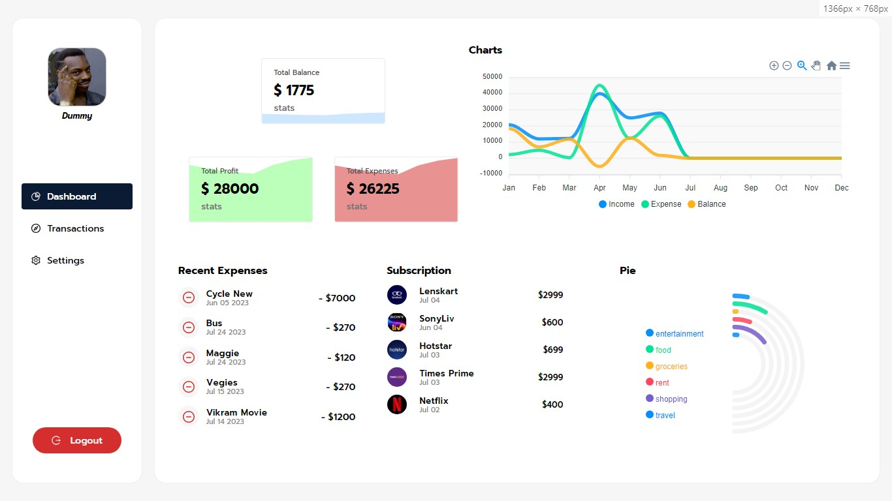

# CoinStrike User Guide

Welcome to the CoinStrike user guide! This guide will walk you through the various features and functionalities of the application, helping you manage your income, expenses, categories, and accounts effectively.

## Technology used

The project is developed using the following MERN technologies and frameworks:

- Frontend: ReactJs, Redux, JavaScript, HTML, CSS
- Backend: Node.js with Express
- Database: mongoDB

## Features

- **User Authentication:** CoinStrike provides secure user authentication functionality, allowing users to create an account, log in, and manage their personal finance data securely.

- **Dashboard Overview:** The interactive dashboard provides an at-a-glance overview of your financial status, including your total income, expenses, savings progress, and budget summaries.

- **Income and Expense Tracking:** CoinStrike allows you to effortlessly record your income and expenses. You can categorize transactions, add descriptions, and specify transaction dates, making it easy to keep track of your financial activities.
- **Subscription Tracking:** CoinStrike allows you to effortlessly record your income and expenses. You can categorize transactions, add descriptions, and specify transaction dates, making it easy to keep track of your financial activities.
- **Block Expense without any Balance:** This feature helps users maintain control over their spending and avoid going into debt. When attempting to add an expense without sufficient balance, CoinStrike displays an alert or notification, reminding users to review their budget and available funds before making any additional expenses 
- **Budget Management:** Set monthly budgets for different categories such as groceries, transportation, entertainment, and more. CoinStrike helps you stay within budget by providing real-time updates and alerts when you approach or exceed your set limits.

- **Expense Analysis:** CoinStrike offers comprehensive expense analysis tools, allowing you to visualize your spending patterns, identify trends, and gain insights into your financial habits. Analyze expenses by category, month, or custom time periods to make informed financial decisions.

- **Reports and Insights:** Generate detailed reports and insightful charts to understand your financial performance better. CoinStrike provides visual representations of your income, expenses, budgets, and savings over time, empowering you to make data-driven decisions.

- **Transaction Sort:** Easily sort and filter transactions based on criteria such as category, amount, or date. CoinStrike's sort functionality helps you quickly locate specific transactions and provides a convenient way to review your financial history.

- **Responsive and User-Friendly Interface:** CoinStrike features a responsive and intuitive user interface, ensuring a seamless user experience across different devices and screen sizes.

## Sections

CoinStrike is divided into the following sections:

1. [Dashboard](#dashboard)
2. [Transactions](#transactions)
3. [Subscription](#categories)
5. [Reports](#reports)
6. [Settings](#settings)

## Dashboard

The dashboard provides an overview of your financial information. It displays your current balance, income, expenses, and may include charts or graphs representing your spending patterns. Use the dashboard to get a quick snapshot of your financial situation.

## Transactions

The transactions feature allows you to add, edit, and delete income and expense entries. You can categorize each transaction to keep track of your spending habits and income sources. Here's how you can use the transactions feature:

1. **View Transactions:** Navigate to the Transactions page to see a list of all your transactions, including their descriptions, amounts, and types (income or expense).
2. **Add Transaction:** Click on the "Add Transaction" button to create a new income or expense entry. Enter the necessary details, such as description, amount, and category.
3. **Edit Transaction:** To modify an existing transaction, click on the edit icon or the transaction itself. Update the necessary fields and save the changes.
4. **Delete Transaction:** If you want to remove a transaction, locate the delete icon next to the transaction and confirm the deletion.

## Modals to Add Entries

The transactions feature allows you to add, edit, and delete income and expense entries. You can categorize each transaction to keep track of your spending habits and income sources

## Subscription

The categories feature allows you to manage and organize your transaction categories. You can create, edit, and delete categories to classify your income and expenses. Follow these steps to work with categories:

1. **View Subscription:** Access the Subscription page to see a list of all your categories, along with their names and parent Subscription (if applicable).
2. **Add Subscription:** Click on the "Add Subscription" button to create a new Subscription. Provide a name for the Subscription and, if needed, select a parent Subscription to create a hierarchy.
3. **Edit Subscription:** To modify a Subscription, locate the edit icon or the Subscription itself. Update the name or parent Subscription as required and save the changes.
4. **Delete Subscription:** If you want to remove a Subscription, find the delete icon next to the Subscription and confirm the deletion. Note that deleting a Subscription may affect associated transactions.

## Reports

The reports feature allows you to generate various reports related to your financial data. You can generate expense reports, income reports, category-wise spending reports, and more. Follow these steps to generate reports:

1. **Select Report Type:** Navigate to the Reports page and choose the type of report you want to generate, such as expense report or income report.
2. **Set Filters (Optional):** If needed, set filters to refine the report results. For example, you can specify a date range or select specific categories.
3. **Generate Report:** Click on the "Generate Report" button to generate the report based on your selections.
4. **View and Export:** Once the report is generated, you can view it on the screen and, if desired, export it to a file format like PDF or CSV.

## Settings

The settings feature allows you to manage your account settings and preferences. You can update your profile information, change passwords, and modify notification preferences. Follow these steps to access and modify your settings:

1. **Access Settings:** Click on the "Settings" option in the menu to navigate to the Settings page.
2. **Update Profile:** Update your profile information, such as username and email address, if necessary.

## Following features are planned for future releases
- Savings Page
- Real Money saving through Paytm
- Dark mode
- Multi-language support
- Multi-currency support

If you have any further questions or need assistance, please reach out to our [development team](./README.md#team).

Enjoy using the CoinStrike!